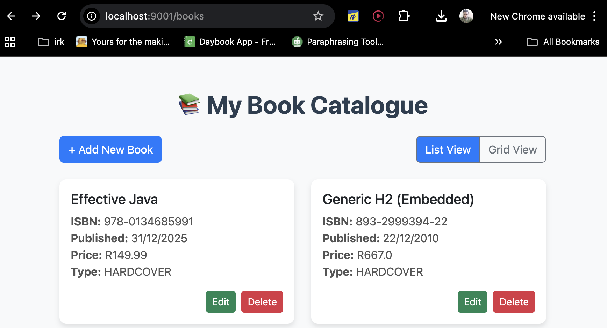
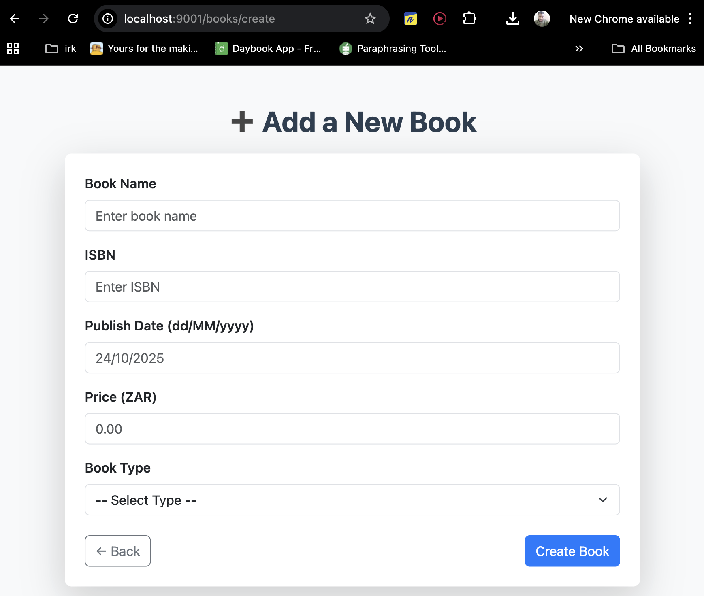
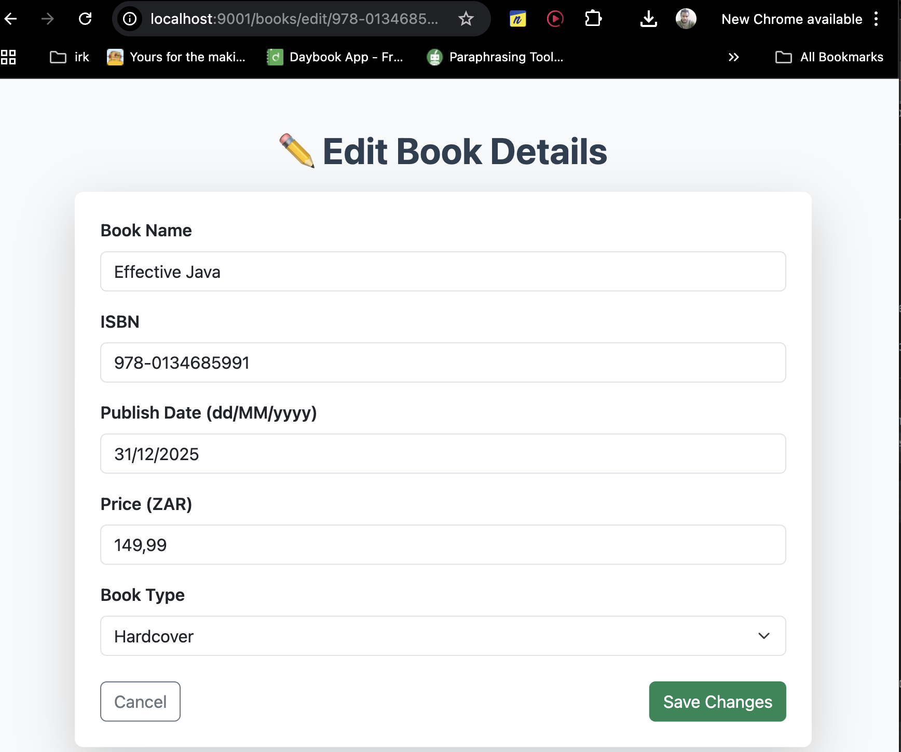
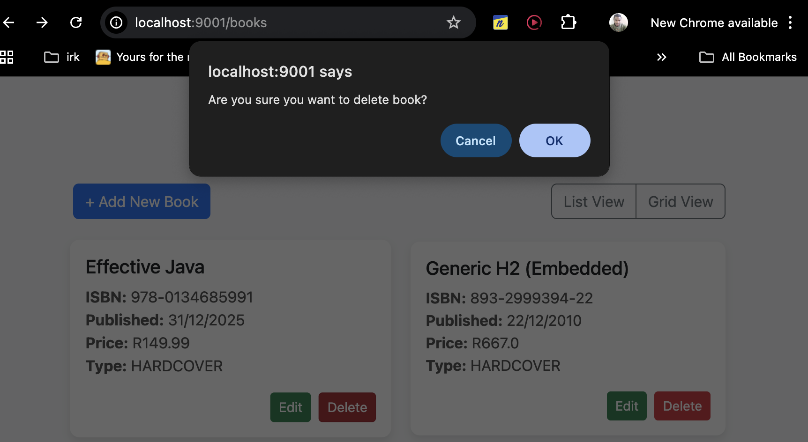
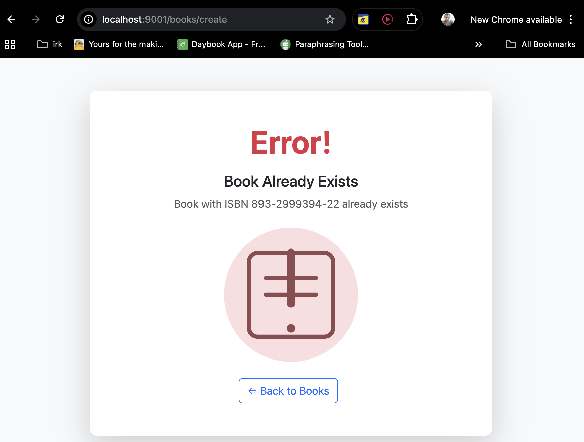

# 📚 Book Catalogue Web Service

A **Spring Boot web application** developed as part of a **PayU technical assessment**.  
This service provides a **user-friendly interface** for book collectors to **view, add, edit, and delete books** using the underlying REST API.

---

## ⚠️ Important Note

The Book Catalogue Web Service depends on the **API backend** to function.

Before starting the web application, make sure the **Book Catalogue API is running** (via `mvn spring-boot:run`).

You can find the API source here: [Book Catalogue API](https://github.com/MrJusticeShai/book-catalogue-api)

If the API is not running, the web service will **fail to load books, create, update, or delete entries**.

---

## 🛠 Technology Stack

| Component         | Version / Detail | Purpose                         |
|-------------------|------------------|---------------------------------|
| Backend Framework | Spring Boot 2.x  | Rapid application development   |
| Language          | Java 1.8         | Core business logic             |
| Build Tool        | Maven            | Project lifecycle management    |
| Templating        | Thymeleaf        | Dynamic HTML rendering          |
| REST Client       | Jersey Client    | Consumes the Book Catalogue API |
| Styling           | Bootstrap 5      | Responsive UI design            |

---

## 🎯 Key Features

- **Dynamic Book Catalogue Web Interface:**  
  View, create, update, and delete books directly from the browser.

- **Thymeleaf Forms with Validation:**
    - All required fields: `name`, `isbn`, `price`, `publishDate`, `bookType`.

- **Error Handling:**
    - `BookAlreadyExistsException` → displays a friendly conflict error page.
    - `BookNotFoundException` → displays a friendly error page. (In case there's multiple users making updates -> delete/edit)
    - Generic errors → handled gracefully via `GlobalExceptionHandler`.

- **CRUD Operations backed by REST API:**  
  The web app interacts with the API service for all book operations.

---

## 🚀 Getting Started

## 🧩 Local Setup — Maven & Build Instructions

Follow these steps to **clone, build, and run** the web application locally.

<details>
<summary>Linux / macOS Instructions</summary>

```bash
# Clone the repository
git clone https://github.com/MrJusticeShai/book-catalogue-web-service.git
cd book-catalogue-web-service

#  Install Maven (if not already installed)
# macOS (via Homebrew)
brew install maven

# Linux (Debian/Ubuntu)
sudo apt update
sudo apt install maven -y

# Build the project
mvn clean package
# Run the Spring Boot web application
mvn spring-boot:run
#  Run unit tests
mvn test

```
The application will be accessible at: http://localhost:9001/books
</details>

---

<details> <summary>Windows Instructions (Command Prompt / PowerShell)</summary>

```bash
# Clone the repository
git clone https://github.com/MrJusticeShai/book-catalogue-web-service.git
cd book-catalogue-web-service

# Download Apache Maven from https://maven.apache.org/download.cgi
# Extract and add the 'bin' directory to your PATH
# Example: C:\apache-maven-3.9.9\bin

# Build and package the project
mvn clean package
#  Run unit tests
mvn test
# Run the Spring Boot web application
mvn spring-boot:run

```

Access the UI at: http://localhost:9001/books

</details>

---

## 💻 Web Application Features

### 1. Book Listing
- Lists all books in a **list** or **grid view**.
- Quick action buttons: **Edit** and **Delete**.
- Responsive design with Bootstrap 5.

**Preview:**

*Replace with your actual screenshot.*

---

### 2. Add a Book
- Form available at `/books/create`.
- Validation rules:
    - ISBN uniqueness
    - Required fields (`name`, `isbn`, `price`, `publishDate`, `bookType`)
    - Price ≥ 0
    - Date format: `dd/MM/yyyy`

**Preview:**


---

### 3. Edit a Book
- Form available at `/books/edit/{isbn}`.
- Preserves original ISBN.
- Allows updating all other fields.
- Validation enforced on submission.

**Preview:**


---

### 4. Delete a Book
- Triggered via `/books/delete/{isbn}`.
- Confirmation popup before deletion.
- Updates listing in real time.

**Preview:**


---

### 5. Error Page
- Displays user-friendly error messages for:
    - Duplicate ISBN
    - Book not found
    - Unexpected exceptions
- Styled consistently with the rest of the web app.

**Preview:**


---